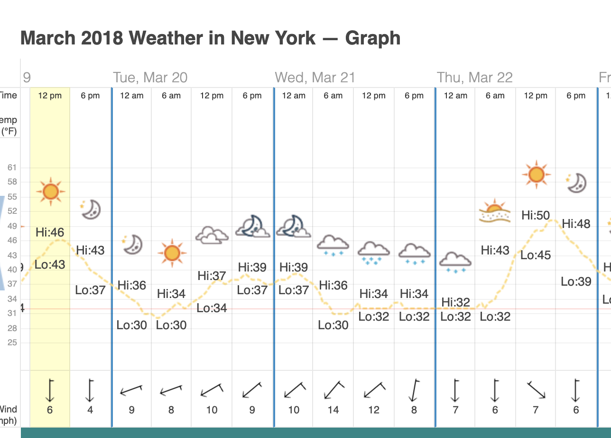

### Homework 15

After plotting and analyszing the data, it would appear that the bulk of the CitiBike riders in this dataset use the bikes primarily as methods of commuting. This conclusion was reached by analyzing the number of riders with regard to several factors including time of day, day of week, month of year, top starting locations, and top destinations.

On average, the overwhelming majority of riders are subscribers. Overall 93.79 percentage of riders are subscribers. While, there are some non subscribers, the non subscriber numbers tend to peak in the summer months, and dip in the winter months. This is shown in the dashboard [Rider Types.](https://public.tableau.com/profile/robert.schroer#!/vizhome/Homework15_15628841863330/RiderTypes)

When we examine the times when these trips happen on the [Time Preferences Dashboard](https://public.tableau.com/profile/robert.schroer#!/vizhome/Homework15_15628841863330/TimePreferences), we can see that they very closly align to commuting times. In both the summer months, and the winter months, the  ridership numbers show very clear peaks around 8 am and 5 pm. Additionally, when examining the day of the week, the average of riders tend to be highest on Wednesday.  However, there is a large amount of seasonal variation in terms of ridership, with the smallest amounts being in the winter months.

The top origins and destinations also support this analysis. For example, the largest riders in both originating and destination locations is [Grove Street PATH](https://public.tableau.com/profile/robert.schroer#!/vizhome/Homework15_15628841863330/TopOriginsandDestinations). That is a train station that contains two train lines that travel to Manhattan. [Grove Street Path Train Station](https://www.google.com/maps/place/Grove+Street+Path+Trains/@40.7230898,-74.0382365,14.42z/data=!4m5!3m4!1s0x89c250b20ff7fe13:0x50875f6c08c8e0c0!8m2!3d40.7196054!4d-74.04264)

One unexpected phenomena found in the data are that there is a large amount of people who most likely lie about being 49.  When viewing the histogram of ages in [Rider Types.](https://public.tableau.com/profile/robert.schroer#!/vizhome/Homework15_15628841863330/RiderTypes), there is a large outlier at that age. 

A second unexpected phenomena is that there can be insights gained about anomalous weather by analyzing the rider patterns. For example, if we look at the [Time Preferences Dashboard](https://public.tableau.com/profile/robert.schroer#!/vizhome/Homework15_15628841863330/TimePreferences) examine the bottom whisker for March, we can see that the day of lowest ridership is March 21, 2018. From there, we can cross reference historic weather websites and see that there was, indeed a snow storm on that day.

